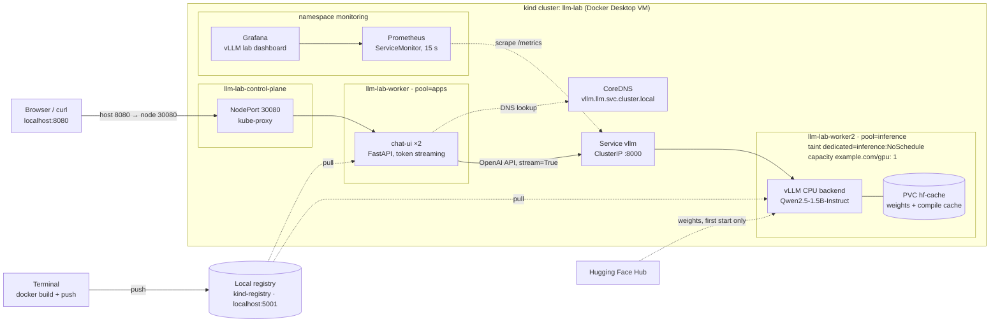

# Kubernetes + self-hosted LLM lab on a Mac

A hands-on lab that runs a three-node Kubernetes cluster on a laptop with [kind](https://kind.sigs.k8s.io/), serves an open model with [vLLM](https://docs.vllm.ai/) on a dedicated, tainted "inference" node with a simulated GPU resource, and puts a small streaming chat UI in front of it. It then adds monitoring, load tests, scaling and rollout exercises, ten break-fix drills, and finally packages everything as a Helm chart.

**Why.** Running LLM inference on Kubernetes is mostly about the platform: fencing off scarce accelerators, scheduling around them, getting traffic and DNS right, sizing memory for the KV cache, measuring time to first token and queue depth, and recovering when things break. All of that can be practised for free on a laptop. The only layer the Mac cannot provide — real GPU drivers and hardware — is covered as a plan in [chapter 10](docs/10-gpu-cloud.md).

Everything is a file in this repository: the cluster, the bootstrap script, the app, the manifests, the Helm chart, and the Grafana dashboard.

## Architecture



| Decision | Choice | Why |
| --- | --- | --- |
| Cluster tool | Standalone `kind`, config in Git ([`cluster/kind-config.yaml`](cluster/kind-config.yaml)) | 100% CLI, reproducible, rebuilt in about a minute |
| Image flow | Local registry container at `localhost:5001` | Mirrors the real build → push → pull path; avoids `kind load` quirks and public-registry rate limits |
| Inference engine | Official `vllm/vllm-openai-cpu` arm64 image, pinned in [`lab.env`](lab.env) | Same OpenAI-compatible API, flags, and Prometheus metrics as GPU vLLM |
| Model | `Qwen/Qwen2.5-1.5B-Instruct` | Apache-2.0, not gated, ~3 GB in bf16, usable speed on CPU |
| Inference node pool | `pool=inference` label + `dedicated=inference:NoSchedule` taint + fake `example.com/gpu: 1` | Reproduces how GPU nodes are fenced off and how a scarce accelerator blocks scaling and rollouts |
| Front end | FastAPI + one HTML page ([`app/`](app)) | Calls vLLM through in-cluster DNS exactly like a real app |
| Exposure | NodePort 30080 mapped to `localhost:8080` | Deterministic on macOS; Ingress is skipped on purpose (ingress-nginx was retired in March 2026; Gateway API is the path forward) |
| Monitoring | metrics-server + kube-prometheus-stack + vLLM `/metrics` | `kubectl top`, HPA, and inference metrics (TTFT, queue depth, KV-cache use) |
| Packaging | Helm 4 chart ([`charts/llm-lab/`](charts/llm-lab)) adopting the running objects | One release with history, rollbacks, and automatic restarts on config change |

## What it demonstrates

| Skill area | In this lab |
| --- | --- |
| Cluster bootstrap, contexts, kubeconfig, idempotent setup script | Real |
| Deployments, Services, DNS, ConfigMaps, Secrets, EndpointSlices | Real |
| Probes, rolling updates, rollbacks, configuration drift | Real |
| Node pools: labels, taints, tolerations | Real |
| Scarce-accelerator scheduling and the surge-rollout deadlock | Simulated with a fake `example.com/gpu` extended resource |
| Model cache on a PersistentVolume | Real |
| Inference metrics: TTFT, inter-token latency, queue depth, KV-cache use | Real metrics, CPU-speed numbers |
| Load testing and benchmarking (`hey`, `vllm bench serve`) | Real |
| HPA, and why CPU is the wrong signal for model servers | Real |
| Break-fix: `Pending`, `CrashLoopBackOff`, `OOMKilled`, no endpoints, DNS, node loss | Real |
| Helm: adopting live objects, server-side apply conflicts, upgrade, rollback | Real |
| GPU drivers, device plugins, GPU telemetry, multi-GPU parallelism | Not covered locally — planned in [chapter 10](docs/10-gpu-cloud.md) |

## Prerequisites

- macOS on Apple silicon (M2 or later for BF16; all measurements below are from an M4 Max)
- Docker Desktop, with its VM sized to **12–16 CPUs, 48 GB RAM**, and ~150 GB disk
- Homebrew packages: `kubernetes-cli` (kubectl), `kind`, `helm` (v4), `k9s`, `stern`, `jq`, `hey`

Details and checks: [00 — Prerequisites](docs/00-prerequisites.md).

## Quickstart

The fastest path to a working chat page, using the Helm chart directly. The chapters walk through the same result step by step.

```bash
brew install kubernetes-cli kind helm k9s stern jq hey
echo 'setopt interactivecomments' >> ~/.zshrc && source ~/.zshrc    # lets zsh accept the # comments below

git clone <repository-url> ~/k8s-llm-lab && cd ~/k8s-llm-lab
source lab.env                                                       # VLLM_TAG

# 1) Cluster, local registry, inference-node taint, fake GPU, metrics-server
./cluster/up.sh

# 2) Mirror the vLLM CPU image and build the chat UI into the local registry
docker pull --platform linux/arm64 vllm/vllm-openai-cpu:$VLLM_TAG
docker tag  vllm/vllm-openai-cpu:$VLLM_TAG localhost:5001/vllm-openai-cpu:$VLLM_TAG
docker push localhost:5001/vllm-openai-cpu:$VLLM_TAG
docker build -t localhost:5001/chat-ui:0.2.0 app/ && docker push localhost:5001/chat-ui:0.2.0

# 3) Install the lab (the ServiceMonitor needs kube-prometheus-stack; chapter 06 adds it)
helm upgrade --install llm-lab charts/llm-lab -n llm \
  --set vllm.image.tag=$VLLM_TAG --set monitoring.serviceMonitor=false
kubectl rollout status deploy/vllm --timeout=20m                     # first start downloads ~3 GB of weights

# 4) Ask a question
open http://localhost:8080
curl -N -s localhost:8080/api/ask -H 'Content-Type: application/json' \
  -d '{"question": "Explain a Kubernetes Service in two sentences."}'; echo
```

After installing kube-prometheus-stack ([chapter 06](docs/06-observability.md#65-prometheus-and-grafana-kube-prometheus-stack)), enable the ServiceMonitor with `helm upgrade llm-lab charts/llm-lab -n llm --set vllm.image.tag=$VLLM_TAG`.

## Measured results

Measured on an Apple M4 Max with a 16-vCPU / 48 GB Docker Desktop VM, vLLM `v0.30.0-arm64` CPU backend, bf16.

| Measurement | Result |
| --- | --- |
| vLLM KV cache with `VLLM_CPU_KVCACHE_SPACE=4` | 149,760 tokens (36.56× concurrency at 4,096 tokens) — matches the formula 4 GiB ÷ 28,672 bytes/token |
| Single-request decode, Qwen2.5-1.5B | ~12 tok/s end to end (28 tokens in 2.28 s); ~83 ms per output token |
| Single-request decode, Qwen2.5-0.5B (`docker run`) | ~26 tok/s end to end |
| vLLM pod ready after restart (model on PVC) | ~50 s, 0 restarts |
| `hey`, 6 concurrent, 60 s through the UI | 143 requests, all 200; p50 2.58 s, p99 3.75 s |
| `vllm bench serve`, 32 prompts, 256 in / 64 out | 35.8 output tok/s; mean TTFT 29 s (p99 51 s, mostly queueing); mean TPOT 122 ms; p99 ITL 1.27 s |
| Same benchmark repeated with the same prompts | 50.6 tok/s, mean TTFT 19.0 s — prefix-cache effect (hit fraction 0.32); `--seed 1` returned to 37.0 tok/s |
| HPA on the UI (`--cpu=60%`, 2–6 replicas) | 4 → 6 replicas within ~75 s under load; 6 → 2 after the 5-minute stabilization window |

## Chapters

| # | Chapter | Covers |
| --- | --- | --- |
| 00 | [Prerequisites](docs/00-prerequisites.md) | Tools, Docker VM sizing, BF16 check |
| 01 | [Cluster and registry](docs/01-cluster-and-registry.md) | kind config, `up.sh`, local registry end to end |
| 02 | [Node pools and fake GPU](docs/02-node-pools-and-fake-gpu.md) | Namespace, taint, extended resource, metrics-server, `up.sh` as repair |
| 03 | [vLLM](docs/03-vllm.md) | Image mirroring, smoke test, manifest, KV-cache sizing, HF token Secret |
| 04 | [Chat UI](docs/04-chat-ui.md) | FastAPI app, image build, Deployment and NodePort Service |
| 05 | [End to end](docs/05-end-to-end.md) | Browser test, load balancing, proving each network hop |
| 06 | [Observability](docs/06-observability.md) | kubectl, logs, k9s, node internals, Prometheus, benchmarks, Grafana dashboard as code |
| 07 | [Scaling, rollouts, HPA](docs/07-scaling-rollouts-hpa.md) | Scaling, the accelerator wall, rollout/rollback, drift, config restarts, HPA |
| 08 | [Troubleshooting drills](docs/08-troubleshooting-drills.md) | Diagnostic ladder and ten break-fix drills |
| 09 | [Helm](docs/09-helm.md) | Chart, adopting live objects, server-side apply conflicts, upgrade and rollback |
| 10 | [From laptop to GPU cloud](docs/10-gpu-cloud.md) | What changes on real GPUs — **not yet run** |
| 11 | [Lessons learned](docs/11-lessons-learned.md) | Real problems hit, how each was diagnosed and fixed, key takeaways |
| — | [Cheat sheet](docs/cheatsheet.md) | Commands worth knowing by heart |
| — | [Restart and teardown](docs/restart-and-teardown.md) | Pause/resume, rebuild, teardown |

## Repository layout

```
.
├── cluster/
│   ├── kind-config.yaml        # 1 control plane + 2 workers (pool=apps, pool=inference); NodePort 30080 → localhost:8080
│   └── up.sh                   # registry, cluster, containerd registry config, namespace, taint, fake GPU, metrics-server
├── lab.env                     # VLLM_TAG pin for the vLLM CPU image
├── app/                        # chat-ui: FastAPI + streaming HTML page (main.py, Dockerfile, requirements.txt)
├── manifests/                  # plain Kubernetes manifests used in chapters 03–08
│   ├── 10-vllm.yaml            # PVC, Deployment, Service (image tag placeholder __VLLM_TAG__)
│   ├── 20-chat-ui.yaml         # ConfigMap, Deployment, NodePort Service
│   └── 30-vllm-servicemonitor.yaml
├── charts/llm-lab/             # Helm chart that replaces manifests/ from chapter 09 on
├── dashboards/vllm-lab.json    # Grafana dashboard (loaded via the Grafana HTTP API)
├── docs/                       # the chapters
└── LICENSE                     # Apache-2.0
```

## References

- [vLLM — CPU installation](https://docs.vllm.ai/en/stable/getting_started/installation/cpu/) (ARM images, environment variables, `SYS_NICE`)
- [vllm/vllm-openai-cpu image tags](https://hub.docker.com/r/vllm/vllm-openai-cpu/tags)
- [vLLM — Using Docker](https://docs.vllm.ai/en/stable/deployment/docker/)
- [kind — Local Registry](https://kind.sigs.k8s.io/docs/user/local-registry/)
- [kind — Configuration](https://kind.sigs.k8s.io/docs/user/configuration/)
- [kind — Releases (node image digests)](https://github.com/kubernetes-sigs/kind/releases)
- [Docker Desktop — Kubernetes](https://docs.docker.com/desktop/use-desktop/kubernetes/)

## License

[Apache-2.0](LICENSE)
